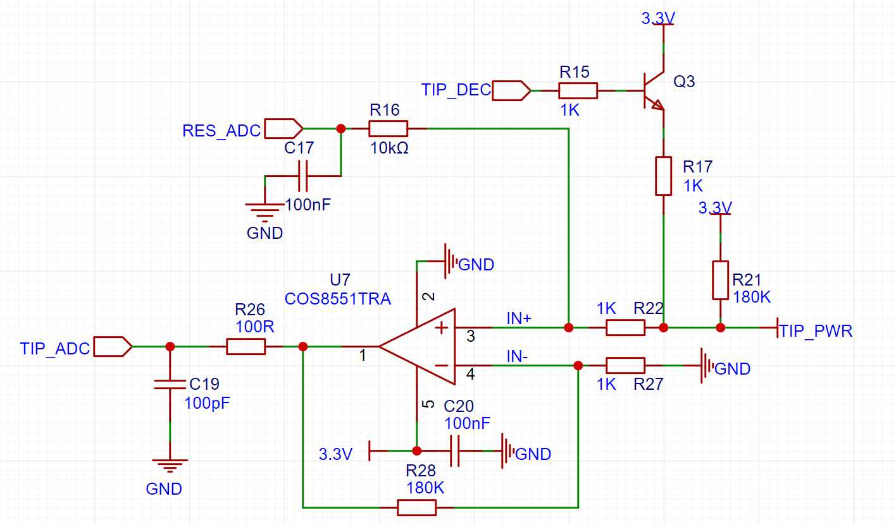

# OSS-TEAM_T12-Plus 2025
OSS-TEAM_T12-Plus 数码管定制版 2025

1、操作说明

    温度调节：左/右旋转编码器，可调节范围100-480摄氏度。
    预设温度模式：旋转调节预设温度（300，350，400）。
    选项设置：长按旋钮进入选项设置，蜂鸣器短鸣一声；短按旋钮切换选项，旋转旋钮更改参数；再次长按推出选项设置，蜂鸣器长鸣一声，参数被保存在flash当中。
    一键温度增强：点击编码器，发热芯一键增强50摄氏度(设定值小于450摄氏度有效)，持续相应设定时间自动退出。
            
2、休眠及待机

    手柄空闲相应设定时间，主机进入待机模式：主机自动调节发热芯温度至用户设置的保护温度；操作编码器或者震动手柄可退出待机模式进入正常模式。
    焊台不使用时，默认60秒进入待机模式，操作编码器或拿起手柄恢复加热模式。

    手柄空闲相应设定时间，主机进入休眠模式：主机关闭发热芯加热，并冷却至室温；操作编码器或者震动手柄可退出休眠模式进入正常模式。
    焊台不使用时，默认5分钟进入休眠模式，操作编码器或拿起手柄恢复加热模式。

    tips: 进入待机或休眠模式，无法使用一键增强温度功能，可长按进入设置选项进行选项设置。
    tips：进入待机或休眠模式，可通过旋转编码器退出待机或休眠模式。

3、休眠及待机模式表

    待机：ON  休眠ON： 手柄空闲相应待机设定时间，进入待机，待机状态下手柄空闲相应休眠设定时间，进入休眠。
    待机：ON  休眠OFF：休眠被关闭，手柄空闲相应待机设定时间，进入待机。
    待机：OFF 休眠ON： 待机被关闭，手柄空闲相应休眠设定时间，进入休眠。
    待机：OFF 休眠OFF：无待机及休眠模式，手柄保持设定温度。

    tips:设置参数大于0为ON状态。

4、状态指示：

        进入待机模式休眠图标闪烁。
        进入休眠模式休眠图标常亮。
        正常状态休眠图标熄灭。
        进入一键温度增强，℃图标闪烁。
        蜂鸣器开启喇叭图标常亮，蜂鸣器关闭喇叭图标熄灭。

5、设置模式操作说明

    1、长按住编码器按键直至进入设置模式P01，左/右旋转编码器修改参数；长按住编码器按键可退出设置模式

    2、点击编码器选择设置选项(当前选项与当前参数交替显示)：
    P01：设置发热芯待机保护温度，可调节范围100-300摄氏度，默认200摄氏度，建议待机温度设定值小于工作温度设定值，否则此温度设置失效。
    P02：待机模式时间，可调节范围1-120秒钟， OFF：关闭待机模式。
    P03：休眠模式时间，可调节范围1-120分钟， OFF：关闭休眠模式。
    PO4：一键增强温度保持时间，可调节范围60-180秒钟。
    P05：声音状态，可调节打开/关闭机器声音。
    P06：发热芯温度校准，可调节校准参数-50到50摄氏度。
    P07：刀头温度补偿，ON：开启尖头温度补偿 OFF：默认刀头补偿。   
    P08；睡眠状态屏下幕变暗，ON：开启该功能 OFF：关闭该功能。

6、状体、故障及错误码

    ---：休眠状态，低于55℃时显示。
    S-E：电烙铁被拔出/电烙铁烧坏。
    E0：短路。
    EF：系统错误，硬件/单片机损坏。
    E1：NTC温度保护，需要重启。
    E2: 无法加热故障（1、烙铁头未安装到位 2、输出电路损坏）旋转编码器退出E2故障。

7、温度保存

    正常模式，温度调节后1s保存温度。

8、最新固件位置

    Project\Objects文件夹（.hex）。
    量产烧录需要官方离线烧录器，选项字节（复位引脚改成普通IO模式）。
    首次烧录时，选择全片擦除。

9、以下器件不贴片及更改

    R4改5mΩ、U5更改型号
    不贴片空置: R15、R16、R17、Q3、C17

10、最后修改日期：

    2025/10/14

